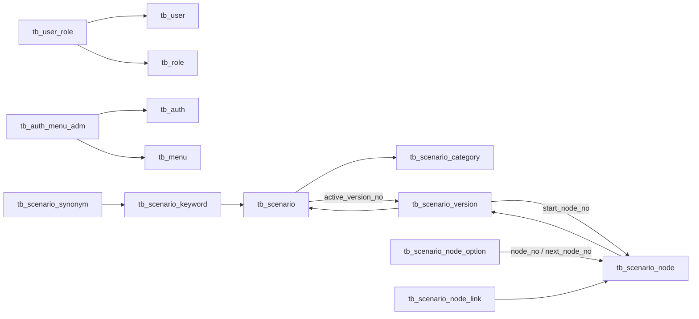
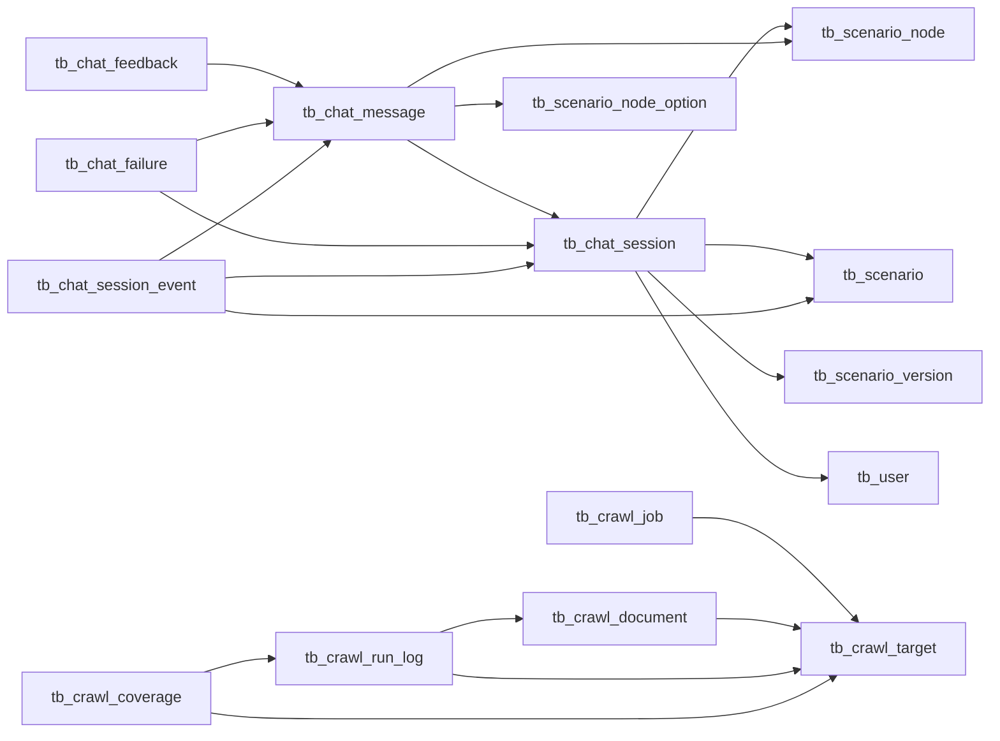

# DB 관계와 데이터 인계

작성일: 2026-09-28 · 작성: Codex · 기준: 개발 DB `cleverchat_dev`, V44 및 현재 소스

[전체 테이블 명세](테이블명세서.md) · [메타데이터 JSON](schema-catalog.json) · [인수인계서](../../5.배포/06.인수인계/README.md)

## 영역별 관계

아래 그림은 핵심 FK의 방향을 보여주는 요약이다. 모든 FK와 삭제 동작은 테이블 명세의 제약조건이 기준이다. 화살표는 **참조하는 테이블 → 참조 대상**이다.

## DB 제약만으로 설명되지 않는 규칙

| 대상 | 인계할 규칙 |
|---|---|
| `tb_system_settings` | `id=1` 단일 행. `version`은 동시 저장 충돌 검사, `auth_version`은 로그인 모드·정책 변경 시 세션 무효화. `runtime_settings`는 [설정 항목표](../../5.배포/02.환경구축가이드/시스템설정_환경변수.md)에 정의된 키의 JSON |
| `tb_user` | LOCAL은 비밀번호 해시 필수. GATEWAY는 비밀번호 NULL, 사번 필수, 사번 부분 UNIQUE. 기존 LOCAL 계정을 SSO 계정과 임의로 병합하지 않음 |
| `tb_role`와 `tb_auth` | 전자는 로그인 역할, 후자는 CMS 메뉴 권한 그룹. 이름이 비슷해도 같은 테이블이나 관계가 아님. 메뉴 노출만으로 서버 권한이 부여되지 않음 |
| `tb_scenario` ↔ `tb_scenario_version` ↔ `tb_scenario_node` | 활성 버전·시작 노드의 순환 참조가 있음. 단순 테이블별 INSERT 순서로 부분 이관하지 말고 일관된 전체 백업이나 서비스의 버전 등록/발행 절차 사용 |
| `tb_chat_message.payload` | 검색 후보·선택지·답변 렌더링 정보와 `navigation.parentMessageNo`를 저장. 이 부모 번호는 JSON 내 **논리 참조**이며 FK가 아님. NULL 부모는 시작점, 구형 payload는 호환 복귀 처리 |
| `tb_chat_session_event` | CHECK에 허용된 전이 이벤트는 `SCENARIO_SWITCH`, `NODE_BACK`, `SEARCH_BACK`. 전체 사용자 행동 추적 로그로 간주하지 않음 |
| `tb_chat_session`와 `spring_session` | 전자는 상담 업무 기록, 후자는 HTTP 인증/세션 저장소. 만료·삭제 정책이 다름 |
| `tb_crawl_job`와 `tb_crawl_run_log` | 전자는 작업 큐(`PENDING/RUNNING/SUCCESS/FAILED/CANCELED`), 후자는 페이지 처리 기록. 작업 완료, 문서 수집 성공, JSON 저장 성공을 각각 확인 |
| `tb_crawl_export_file.target_no` | 현재 물리 FK가 없는 대상 번호. JSON 파일 자동 정리용 레지스트리이며 파일 자체를 DB에 저장하지 않음 |
| `tb_crawl_document.content_tokens` | Nori 분석으로 만든 검색 토큰. 본문/토큰/검색 SQL을 함께 고려해야 검색 품질이 유지됨 |
| 암호문·키 ID 컬럼 | DB 백업만으로 복호화되지 않음. 현재·이전 암호화 키도 별도 안전하게 인계. 평문/마스킹/암호문 이관을 임의로 혼합하지 않음 |

DB COMMENT는 생성 당시 설명일 수 있다. 예를 들어 메시지 방향 COMMENT에는 USER/BOT만 적혀 있지만 현재 CHECK에는 SYSTEM도 허용된다. **허용값은 현재 CHECK와 서비스 검증을 함께 확인**한다. 등록자 컬럼도 테이블에 따라 사용자 번호 FK 또는 문자열이므로 이름만 보고 조인하지 않는다.

## 데이터 인계 단위

| 자산 | 포함할 것 | 누락 시 영향 |
|---|---|---|
| DB 구조·기초 코드 | Flyway SQL 전체, 적용 이력 | 새 환경 기동/검증 실패 |
| 업무 DB | 시나리오 모든 버전·노드·옵션·키워드·링크, 수집 대상/문서, 운영 설정, 필요한 업무 이력 | 빈 시나리오/검색 결과, 잘못된 운영값 |
| 외부 파일 | 생성된 JSON, 경로 대응표, 사용 중인 브라우저/네이티브 자산 | DB에 경로만 남거나 수집 실행 실패 |
| 암호화 자료 | 현재 key ID/키와 복호화에 필요한 이전 키 | 기존 대화/민감 필드 복호화 불가 |
| 서버 설정 | 프로파일, 스키마/search_path, 시간대, 프록시/연계 설정 | 엉뚱한 스키마 사용, 정리 시각 변경, 로그인 실패 |

개발 DB를 운영에 그대로 복사하면 개발 계정·세션·대화 이력까지 포함될 수 있다. 이관할 업무 데이터 범위는 인수 책임자가 정하고, 실제 파일 전달은 접근 통제된 저장소로 수행한다. 이 문서 작업은 업무 DB 덤프를 새로 생성하거나 전달하지 않았다.

## 변경·복구 원칙

1. 신규 버전 SQL을 추가하고 빈 DB와 기존 백업 복구 DB 모두에서 검증한다. 적용된 V1~V44 파일의 내용을 수정해 이력을 맞추지 않는다.
2. `DB_SCHEMA`는 dev에서만 직접 참조한다. stage/prod는 JDBC currentSchema와 Flyway 대상 스키마를 일치시킨다. 2026-09-29 신규 설치 검증에서 V20~V23의 search_path가 `cleverchat_dev`로 고정된 것을 확인했으므로 현재 전체 초기 설치는 이 스키마를 사용한다. 임의 스키마 전환에는 별도 마이그레이션 검증이 필요하다.
3. 배포 전 DB와 JSON을 백업하고 복구 가능 여부를 확인한다. PK 값과 시퀀스 상태를 함께 유지한다.
4. JAR 되돌리기는 DB 스키마/데이터까지 되돌리지 않는다. 구버전과 호환되지 않으면 별도 DB 복구 계획이 필요하다.
5. 복구 DB에서는 수집·JSON 자동 정리·알림 등 부수 작업이 실환경에 영향을 주지 않도록 실행 전 점검한다. 설정은 DB 저장값이 환경변수보다 우선할 수 있다.
6. [명세 추출 도구](../../3.개발/cleverchat/tools/export_db_spec.py)를 재실행하고 변경 내용을 검토한다. JSON 스냅샷은 DDL 설치 스크립트나 업무 데이터 백업이 아니다.
