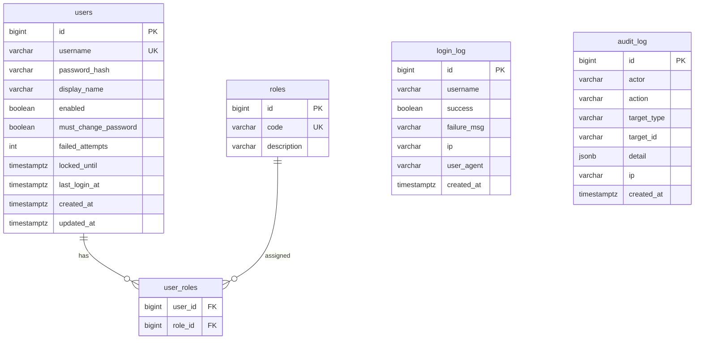

# ERD 초안

> 작성일: 2026-05-08
> 변경요약: M1 인증/세션/감사 로그 테이블 기준 보완, M2/M3/M4 상세 ERD 분리

## M1 결정

- 초기 관리자 계정은 Flyway `V4_1__seed_default_admin.sql`로 DB에 생성한다. 개발/검증 기본값은 `admin/admin`이며, 운영 배포 전 비밀번호 변경 또는 별도 운영 시딩 정책을 재검토한다.
- 세션은 Spring Session JDBC를 사용하며 테이블은 Flyway `V2__auth_session_baseline.sql`에서 관리한다.
- 로그인 실패 잠금 정책 기본값은 5회 실패 시 30분 잠금이다.
- `roles.code`는 HandlerInterceptor 권한 검사에서 `ROLE_` 접두사를 붙여 세션 VO의 권한 코드와 비교한다.

## M2 상세 설계

- 시나리오/버전/노드/옵션/키워드/유사어 ERD: `2.설계/02.DB설계서/M2_시나리오ERD.md`
- 인덱스 설계: `2.설계/02.DB설계서/인덱스설계.md`
- Flyway 구현 대상: `V3__scenario_baseline.sql`
- 인증 보완 Flyway: `V3_1__auth_must_change_password.sql`에서 `users.must_change_password BOOLEAN NOT NULL DEFAULT false`를 추가한다.

### M2 결정사항 9절 동기화

- `users.must_change_password` 컬럼은 V3가 아닌 `V3_1__auth_must_change_password.sql`에서 분리 추가한다.
- OPERATOR 운영 기본 계정은 V3.1 적용 이후 비활성 상태(`enabled=false`)와 `must_change_password=true` 기본값으로 시딩한다.
- 본 ERD 초안은 인증 테이블 보완 기준만 표시하며, M2 시나리오 테이블 상세는 `M2_시나리오ERD.md`를 단일 상세 기준으로 삼는다.

## M3 상세 설계

- 챗봇 런타임 세션/메시지/피드백/실패 큐 ERD: `2.설계/02.DB설계서/M3_챗봇런타임ERD.md`
- Flyway 구현 대상: `V4__chat_runtime_baseline.sql`
- 대화 이력 보존 기간: 90일

## M4 상세 설계

- 검색 generated column, 검색 로그, 차단 로그, 인기 검색어 ERD: `2.설계/02.DB설계서/M4_검색ERD.md`
- Flyway 구현 대상: `V5__search_baseline.sql`
- PostgreSQL 확장: `pg_trgm`, `unaccent`
- 검색 로그 보존 기간: 90일
