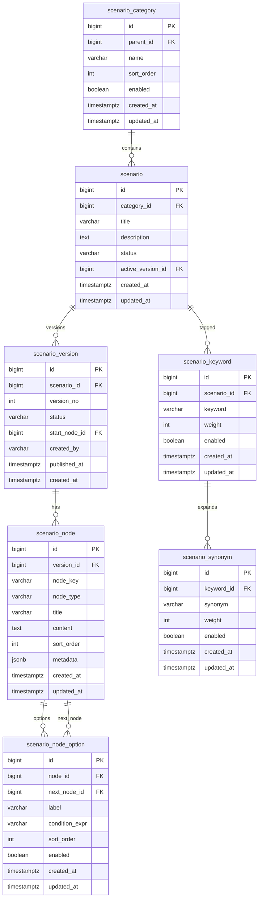

# M2 시나리오 ERD

> 작성일: 2026-05-08
> 목적: 시나리오 관리 CRUD, 버전, 노드 구조, 키워드/유사어 구현 기준

## 1. 코드 값

| 컬럼 | 값 | 설명 |
|---|---|---|
| `scenario.status` | `DRAFT`, `ACTIVE`, `INACTIVE`, `DELETED` | 시나리오 운영 상태 |
| `scenario_version.status` | `DRAFT`, `PUBLISHED`, `ARCHIVED` | 버전 상태 |
| `scenario_node.node_type` | `QUESTION`, `ANSWER`, `BRANCH`, `END` | 노드 유형 |

## 2. 주요 제약

- `scenario_category.name`은 같은 `parent_id` 하위에서 중복 불가.
- `scenario_version`은 `(scenario_id, version_no)` 중복 불가.
- `scenario_node`는 `(version_id, node_key)` 중복 불가.
- `scenario_node_option.next_node_id`는 같은 `version_id`의 노드만 참조해야 한다. DB FK만으로 부족하면 서비스 검증을 추가한다.
- `scenario.active_version_id`는 `PUBLISHED` 버전만 지정할 수 있다. 상태 검증은 서비스에서 처리한다.
- 삭제는 기본적으로 논리 삭제(`DELETED`, `enabled=false`)를 사용한다.

## 2.1 P0 graph 편집 저장 기준

- P0 graph 편집 화면은 기존 `scenario_version`, `scenario_node`, `scenario_node_option` 테이블만 사용하며 DB/Flyway 변경은 없다.
- graph 저장은 DRAFT 버전에서만 허용하고, 저장 시 해당 버전의 기존 node/option을 교체 저장한다.
- graph 조회는 DRAFT/PUBLISHED/ARCHIVED 모두 허용하며, 저장된 노드가 없으면 빈 graph payload를 반환한다.

## 3. Flyway 초안

- 파일명: `V3__scenario_baseline.sql`
- V3 범위: 시나리오/버전/노드/옵션/키워드/유사어 테이블과 관련 제약/인덱스만 포함한다.
- 인증 테이블 보완: `users.must_change_password BOOLEAN NOT NULL DEFAULT false`는 `V3_1__auth_must_change_password.sql`에서 분리 적용한다.
- OPERATOR 시더는 V3.1 컬럼 적용 후 비활성 계정(`enabled=false`)과 `must_change_password=true` 기본값을 사용한다.
- 확장: M4 검색 적용 시 `pg_trgm`, FTS 인덱스 추가
- 감사 컬럼은 `created_at`, `updated_at`을 기본으로 두고, 상세 변경 이력은 `audit_log.detail`에 기록한다.
