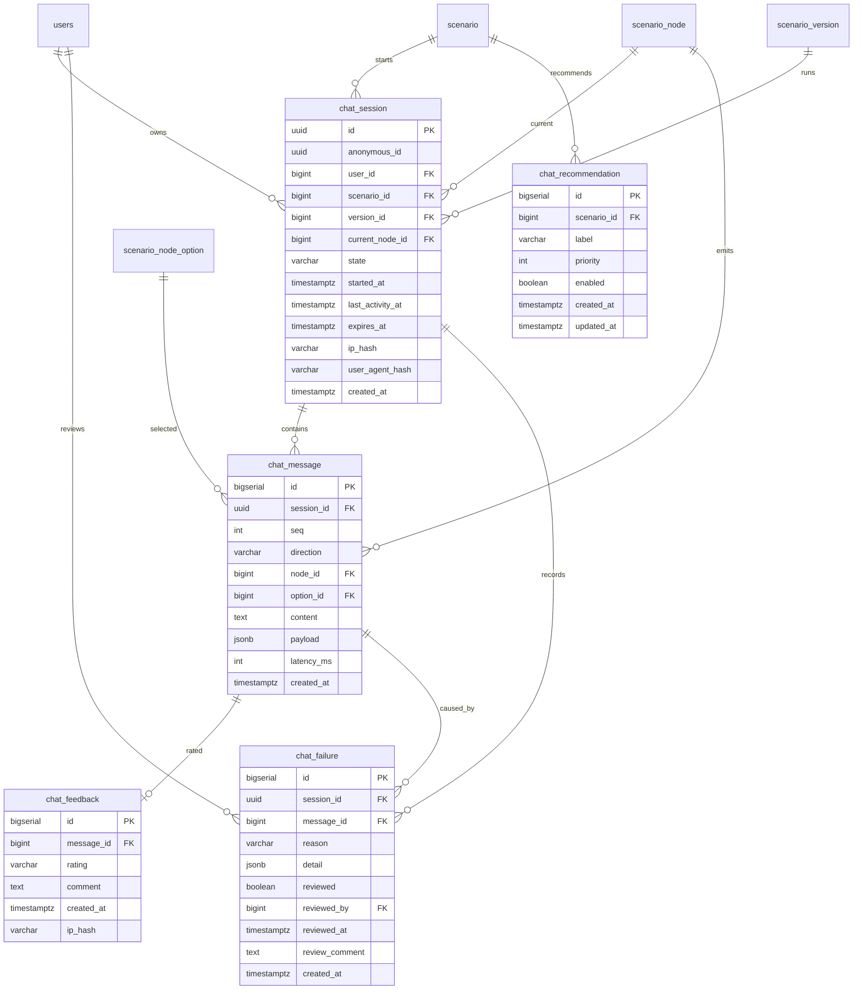

# M3 챗봇 런타임 ERD

> 작성일: 2026-05-08  
> 대상: 사용자 챗봇 런타임, 대화 세션, 이력, 만족도, 실패 큐  
> 선행: `M2_시나리오ERD.md`, `인덱스설계.md`

## 1. 확정 결정값

| # | 항목 | 채택안 | 사유 |
|---|---|---|---|
| 1 | 비로그인 사용자 식별 | HttpOnly `anonymous_id` 쿠키(UUID, 1년) + 서버 세션 | 세션 만료 후에도 이력과 만족도를 연결할 수 있고 IP 기반 식별보다 개인정보 위험이 낮다. |
| 2 | 대화 상태 저장소 | `chat_session` DB 테이블 | 단일 노드 결정과 맞고 만료, 복구, 운영 추적이 쉽다. |
| 3 | fallback 정책 | 1차 키워드 검색 결과 카드, M4 이후 추천 시나리오 분기 | M3은 stub과 실패 로그를 남기고 검색 품질은 M4에서 고도화한다. |
| 4 | 추천 질문 기준 | 운영자 고정 1차, 캐시 미사용, 최근 사용량 2차 보강 | 초기 데이터 부족을 운영자 큐레이션으로 보완하고, M3 사용자 응답은 매 요청 DB 조회로 최신 활성 상태를 반영한다. |
| 5 | 대화 이력 보존 | 90일 | 품질 분석 기간과 개인정보 최소 보존 원칙의 균형을 둔다. |
| 6 | 만족도 수집 | thumbs + 선택 코멘트 | 비용이 낮고 개선 단서를 확보할 수 있다. |
| 7 | 조건식 실행 | M3 미지원 | NodeOption 단순 분기로 시작해 보안과 테스트 부담을 줄인다. |
| 8 | 사용자 화면 채널 | 전용 페이지 `/chat` 우선 | 삽입형 위젯은 CSP/CORS/도메인 정책 검토 후 백로그로 둔다. |

## 2. ERD

## 3. 신규 테이블 정의

### 3.1 `chat_session`

| 컬럼 | 타입 | 제약 | 설명 |
|---|---|---|---|
| `id` | UUID | PK | 런타임 세션 ID |
| `anonymous_id` | UUID | NOT NULL | 비로그인 사용자 쿠키 식별자 |
| `user_id` | BIGINT | NULL, FK `users(id)` | 로그인 사용자일 때만 연결 |
| `scenario_id` | BIGINT | NOT NULL, FK `scenario(id)` | 시작 시나리오 |
| `version_id` | BIGINT | NOT NULL, FK `scenario_version(id)` | 시작 시점의 `PUBLISHED` 버전 |
| `current_node_id` | BIGINT | NULL, FK `scenario_node(id)` | 현재 노드. 종료 후 NULL 허용 |
| `state` | VARCHAR(20) | NOT NULL | `ACTIVE`, `COMPLETED`, `ABANDONED`, `EXPIRED` |
| `started_at` | TIMESTAMPTZ | NOT NULL | 시작 시각 |
| `last_activity_at` | TIMESTAMPTZ | NOT NULL | 마지막 요청 또는 메시지 저장 시각 |
| `expires_at` | TIMESTAMPTZ | NOT NULL | 마지막 활동 + 30분 |
| `ip_hash` | VARCHAR(64) | NOT NULL | SHA-256 + 서버 솔트 |
| `user_agent_hash` | VARCHAR(64) | NULL | SHA-256 + 서버 솔트 |
| `created_at` | TIMESTAMPTZ | NOT NULL | 생성 시각 |

업무 제약:

- `scenario_id`, `version_id`는 생성 후 변경하지 않는다.
- 신규 세션은 해당 시나리오의 최신 `PUBLISHED` 버전만 사용한다.
- `ARCHIVED` 버전은 이미 진행 중인 세션에서만 계속 참조할 수 있다.

구현 매핑 규약:

- DB 컬럼 `chat_session.id`, `chat_session.anonymous_id`, `chat_message.session_id`, `chat_failure.session_id`의 물리 타입은 UUID다.
- MyBatis 모델에서는 `ChatSession.id`, `ChatSession.anonymousId`, 메시지/실패의 `sessionId`를 `String`으로 매핑한다.
- 사용자 API 경계에서는 path variable, cookie, 응답 DTO를 `UUID`로 검증·표현하고 서비스/매퍼 호출 전후에 `String`과 `UUID`를 명시적으로 변환한다.

### 3.2 `chat_message`

| 컬럼 | 타입 | 제약 | 설명 |
|---|---|---|---|
| `id` | BIGSERIAL | PK | 메시지 ID |
| `session_id` | UUID | NOT NULL, FK `chat_session(id)` | 소속 세션 |
| `seq` | INT | NOT NULL | 세션 내 순번 |
| `direction` | VARCHAR(10) | NOT NULL | `USER`, `BOT`, `SYSTEM` |
| `node_id` | BIGINT | NULL, FK `scenario_node(id)` | 연관 노드 |
| `option_id` | BIGINT | NULL, FK `scenario_node_option(id)` | 선택 옵션 |
| `content` | TEXT | NOT NULL | 표시 메시지. 서버 검증 길이 제한 적용 |
| `payload` | JSONB | NULL | 버튼 목록, fallback 카드 등 구조화 데이터 |
| `latency_ms` | INT | NULL | 응답 생성 소요 시간 |
| `created_at` | TIMESTAMPTZ | NOT NULL | 생성 시각 |

업무 제약:

- `(session_id, seq)`는 UNIQUE이며 seq는 세션 내 단조 증가한다.
- seq 충돌 방지는 `pg_advisory_xact_lock(hashtext('chat_session:' || session_id::text))`로 단일화한다.
- `content`는 사용자 입력 500자, 시스템/봇 출력 10,000자 이하를 서비스에서 검증한다.

### 3.3 `chat_feedback`

| 컬럼 | 타입 | 제약 | 설명 |
|---|---|---|---|
| `id` | BIGSERIAL | PK | 피드백 ID |
| `message_id` | BIGINT | NOT NULL, UNIQUE, FK `chat_message(id)` | 평가 대상 봇 메시지 |
| `rating` | VARCHAR(10) | NOT NULL | `UP`, `DOWN` |
| `comment` | TEXT | NULL | 선택 코멘트. 1,000자 이하 |
| `created_at` | TIMESTAMPTZ | NOT NULL | 등록 시각 |
| `ip_hash` | VARCHAR(64) | NOT NULL | SHA-256 + 서버 솔트 |

### 3.4 `chat_failure`

| 컬럼 | 타입 | 제약 | 설명 |
|---|---|---|---|
| `id` | BIGSERIAL | PK | 실패 ID |
| `session_id` | UUID | NOT NULL, FK `chat_session(id)` | 소속 세션 |
| `message_id` | BIGINT | NULL, FK `chat_message(id)` | 실패를 유발한 사용자 메시지 |
| `reason` | VARCHAR(30) | NOT NULL | `NO_MATCH`, `EXPIRED`, `INVALID_OPTION`, `SYSTEM_ERROR`, `PII_BLOCKED`, `RATE_LIMITED` |
| `detail` | JSONB | NULL | 매칭 후보, 입력 요약, 시스템 오류 코드 |
| `reviewed` | BOOLEAN | NOT NULL DEFAULT false | 관리자 확인 여부 |
| `reviewed_by` | BIGINT | NULL, FK `users(id)` | 확인 관리자 |
| `reviewed_at` | TIMESTAMPTZ | NULL | 확인 시각 |
| `review_comment` | TEXT | NULL | 관리자 검토 코멘트. 원문 PII 입력 금지, 1,000자 이하 서비스 검증 |
| `created_at` | TIMESTAMPTZ | NOT NULL | 생성 시각 |

`detail` 표준 키 사전:

| 키 | 타입 | 적용 reason | 설명 |
|---|---|---|---|
| `inputLength` | number | 공통 | 사용자 입력 원문 길이. 원문은 저장하지 않는다. |
| `inputSummary` | string | `NO_MATCH`, `INVALID_OPTION` | 100자 이하 마스킹 요약. 개인정보와 토큰은 제거한다. |
| `currentNodeId` | number | `NO_MATCH`, `INVALID_OPTION` | 실패 발생 시점의 현재 노드 ID |
| `requestedOptionId` | number | `INVALID_OPTION` | 사용자가 요청한 옵션 ID |
| `candidateOptionIds` | array<number> | `NO_MATCH`, `INVALID_OPTION` | 현재 노드에서 선택 가능한 옵션 ID 목록 또는 매칭 후보 |
| `matchedScenarioIds` | array<number> | `NO_MATCH` | 전역 키워드/유사어 또는 fallback 후보 시나리오 ID. 결과 없음이면 빈 배열 |
| `fallbackSource` | string | `NO_MATCH` | `CURRENT_OPTION`, `GLOBAL_KEYWORD`, `M4_STUB`, `NONE` 중 하나 |
| `expiredAt` | string | `EXPIRED` | ISO-8601 만료 시각 |
| `lastActivityAt` | string | `EXPIRED` | ISO-8601 마지막 활동 시각 |
| `errorCode` | string | `SYSTEM_ERROR`, 공통 | 애플리케이션 내부 오류 분류 코드. stack trace는 저장하지 않는다. |
| `exceptionType` | string | `SYSTEM_ERROR` | 예외 클래스 단순명만 저장한다. 메시지와 stack trace는 제외한다. |
| `piiTypes` | array<string> | `PII_BLOCKED` | 탐지 유형. 예: `PHONE`, `EMAIL`, `RRN_CANDIDATE` |
| `rateLimitKey` | string | `RATE_LIMITED` | anonymous_id 원문이 아닌 rate limit 집계 키 또는 해시 |
| `limit` | number | `RATE_LIMITED` | 허용 요청 수 |
| `windowSeconds` | number | `RATE_LIMITED` | 제한 시간 창(초) |
| `requestId` | string | 공통 | 클라이언트 또는 서버에서 생성한 요청 추적 ID |

작성 규칙:

- `detail`에는 사용자 입력 원문, `anonymous_id` 원문, IP 원문, User-Agent 원문, CSRF 토큰, 세션 ID, stack trace를 저장하지 않는다.
- 표준 키 외 확장이 필요하면 하위 객체 `extra`에 넣고, 운영 화면 노출 전 마스킹 규칙을 추가한다.
- 날짜/시간 값은 애플리케이션 표준 타임존 포함 ISO-8601 문자열로 저장한다.

### 3.5 `chat_recommendation`

| 컬럼 | 타입 | 제약 | 설명 |
|---|---|---|---|
| `id` | BIGSERIAL | PK | 추천 질문 ID |
| `scenario_id` | BIGINT | NOT NULL, FK `scenario(id)` | 연결 시나리오 |
| `label` | VARCHAR(200) | NOT NULL | 노출 문구 |
| `priority` | INT | NOT NULL DEFAULT 100 | 낮을수록 우선 노출 |
| `enabled` | BOOLEAN | NOT NULL DEFAULT true | 노출 여부 |
| `created_at` | TIMESTAMPTZ | NOT NULL | 생성 시각 |
| `updated_at` | TIMESTAMPTZ | NOT NULL | 수정 시각 |

업무 제약:

- 추천 질문은 별도 캐시를 사용하지 않고 사용자 API 요청마다 DB에서 조회한다.
- 사용자 추천 질문 조회는 `chat_recommendation.enabled=true`이고 연결 시나리오와 카테고리가 모두 활성 상태인 항목만 반환한다.
- 카테고리 비활성화 저장 성공 시 추천 질문 응답은 즉시 제외되어야 하며, 별도 캐시 무효화는 필요하지 않다.

## 4. 필수 인덱스

| 테이블 | 인덱스 | 목적 |
|---|---|---|
| `chat_session` | `(anonymous_id, started_at DESC)` | 본인 이력 조회 |
| `chat_session` | `(state, expires_at)` | 만료 배치 대상 조회 |
| `chat_message` | `(session_id, seq)` UNIQUE | 대화 이력 순서와 중복 방지 |
| `chat_failure` | `(reviewed, created_at DESC)` | 미처리 실패 큐 |
| `chat_feedback` | `(rating, created_at DESC)` | 만족도 목록/통계 |
| `chat_recommendation` | `(enabled, priority, id)` | 추천 질문 노출 |

## 5. Flyway 마이그레이션 계획

| 버전 | 파일 | 내용 |
|---|---|---|
| V4 | `V4__chat_runtime_baseline.sql` | `chat_session`, `chat_message`, `chat_feedback`, `chat_failure`, `chat_recommendation` 생성 |
| V5 후보 | `V5__chat_runtime_retention_job_indexes.sql` | 운영 데이터 증가 후 파기 배치 보조 인덱스 조정 |

## 6. 구현 검수 메모

| 항목 | 검수 기준 |
|---|---|
| Flyway/ERD 일치 | V4 SQL, 본 ERD, MyBatis model의 컬럼은 `chat_failure.review_comment`를 포함해 동일해야 한다. |
| BOT 피드백 제약 | `chat_feedback.message_id`는 DB FK 외에 서비스에서 `chat_message.direction='BOT'`을 재검증한다. |
| 버전 정합 | `current_node_id`, `node_id`, `option_id`는 세션의 `version_id`에 속한 데이터만 허용한다. |
| 원문 식별자 금지 | `anonymous_id`, IP, User-Agent, CSRF token 원문은 관리자 화면/API/로그에 노출하지 않는다. |
| 삭제 순서 | 90일 파기는 `chat_feedback` → `chat_failure` → `chat_message` → `chat_session` 순서로 chunk 처리한다. |

구현 메모:

- PostgreSQL UUID 생성은 `gen_random_uuid()` 사용을 권장한다. 확장 사용 여부는 V1~V3와 충돌하지 않게 확인한다.
- `scenario_id`/`version_id` 변경 불가는 DB 트리거 또는 서비스 정책으로 보장한다. 초기 구현은 서비스 불변 검증 + 감사 로그로 시작한다.
- `chat_feedback.message_id`는 UNIQUE로 두어 중복 평가를 DB에서 차단한다.

## 7. 보존/파기 정책

- `chat_session`, `chat_message`, `chat_feedback`, `chat_failure`는 `created_at` 또는 `started_at` 기준 90일 후 파기한다.
- 파기 순서는 FK를 고려해 `chat_feedback` → `chat_failure` → `chat_message` → `chat_session` 순으로 처리한다.
- `chat_recommendation`은 운영 설정 데이터이므로 90일 파기 대상이 아니다. 비활성 데이터 보존 기간은 M6 운영 정책에서 별도 확정한다.
- 파기 배치는 일일 실행, 건수 상한, 검증 쿼리를 운영메모에 둔다.

## 8. PR 수용 기준

- [ ] 세션 시작/진행/종료/만료가 ERD, API, 상태전이도에서 같은 상태값으로 추적된다.
- [ ] `anonymous_id` 쿠키 분실 시 새 세션 전환 흐름이 화면설계서에 명시된다.
- [ ] `chat_message.seq`의 세션 내 단조 증가와 충돌 방지 전략이 구현 지시서에 반영된다.
- [ ] 90일 파기 대상과 순서가 운영메모와 일치한다.
- [ ] M2 `scenario_node`/`scenario_node_option` 구조 변경 없이 런타임 참조가 가능하다.
