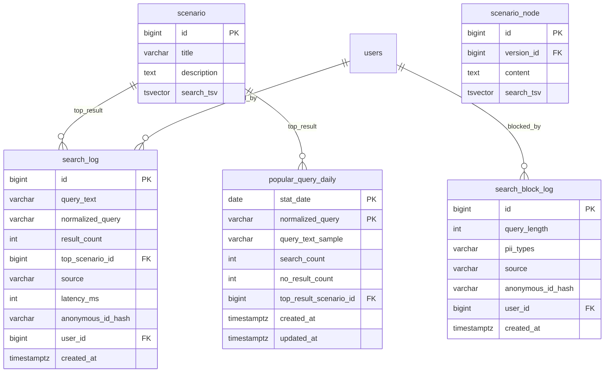

# M4 검색 ERD

> 작성일: 2026-05-11
> 대상: PostgreSQL FTS 기반 fallback 검색, 검색 로그, 인기 검색어 집계

## 1. 개요

M4는 기존 M2/M3 테이블에 검색용 generated column과 인덱스를 추가하고, 검색 행위 로그를 별도 테이블에 저장한다.

## 2. 테이블

| 테이블 | 목적 | 보존 |
|---|---|---|
| `search_log` | 정상 검색 로그와 결과 건수/지연 시간 기록 | 90일 |
| `search_block_log` | PII 차단 검색 기록. 원문 저장 금지 | 90일 |
| `popular_query_daily` | 일별 인기 검색어 집계 | 운영 정책에 따라 장기 보관 가능 |

## 3. generated column

| 테이블 | 컬럼 | 기준 |
|---|---|---|
| `scenario` | `search_tsv` | 제목 A, 설명 C 가중치 |
| `scenario_node` | `search_tsv` | 본문 B 가중치 |

`simple` configuration을 사용하고 `unaccent`로 검색어와 대상 문자열을 정규화한다.

## 4. 제약

- `search_log.query_text`는 200자 이하의 정규 검색어만 저장한다.
- PII 차단 검색은 `search_log`에 저장하지 않고 `search_block_log`에 길이와 PII 유형만 저장한다.
- `source`는 `CHAT_FALLBACK`, `ADMIN_TEST`, `API` 중 하나다.
- `anonymous_id_hash`는 M3 해시 정책을 재사용한다.
