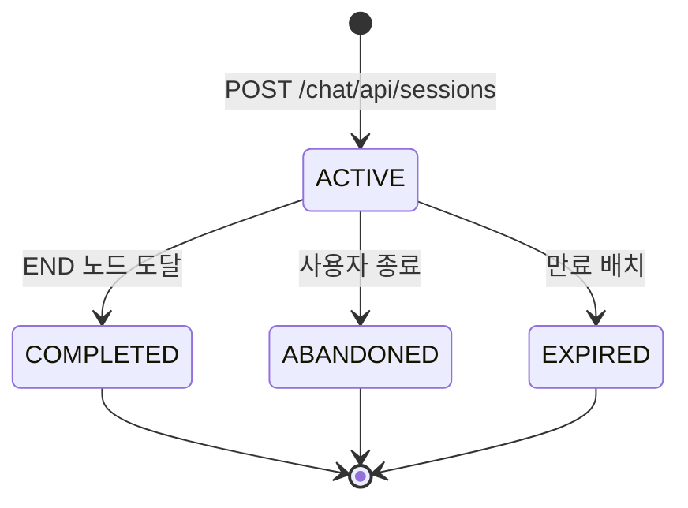
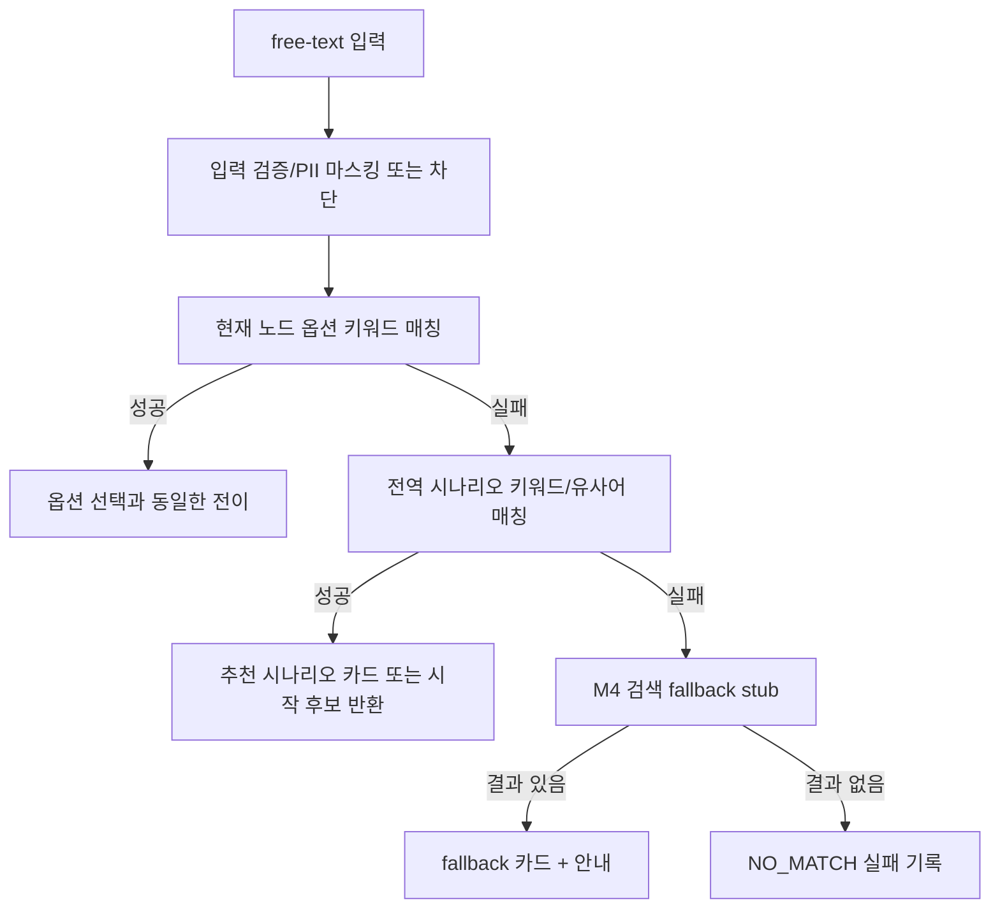

# M3 챗봇 런타임 상태전이도

> 작성일: 2026-05-08  
> 대상: `chat_session.state`, 노드 전이, 동시성, 트랜잭션 경계

## 1. 확정 결정값

- 세션 상태는 `chat_session` DB 테이블에 저장한다.
- 신규 세션은 최신 `PUBLISHED` 시나리오 버전으로만 시작한다.
- 진행 중 세션은 시작 당시 버전이 `ARCHIVED` 되어도 계속 유지한다.
- 조건식 DSL은 M3에서 실행하지 않고 옵션 선택에 따른 단순 전이만 지원한다.
- 만료 기준은 마지막 활동 후 30분이다.

## 2. 세션 상태 전이도

| 현재 | 다음 | 트리거 | 처리 |
|---|---|---|---|
| 없음 | `ACTIVE` | 세션 시작 | `chat_session` 생성, 시작 봇 메시지 저장 |
| `ACTIVE` | `ACTIVE` | 옵션 선택/자유 텍스트 매칭 | 사용자 메시지, 봇 메시지 저장, 현재 노드 갱신 |
| `ACTIVE` | `COMPLETED` | `END` 노드 도달 | 종료 봇 메시지 저장, 입력 비활성화 |
| `ACTIVE` | `ABANDONED` | `/end` 요청 | 시스템 메시지 저장 후보, 종료 상태 반영 |
| `ACTIVE` | `EXPIRED` | 만료 배치 | `expires_at < now()` 대상 일괄 갱신 |
| `COMPLETED` | 변경 없음 | 추가 진행 요청 | `CHAT_NODE_TERMINAL` |
| `ABANDONED` | 변경 없음 | 추가 진행 요청 | `CHAT_NODE_TERMINAL` 또는 `STATE_CONFLICT` |
| `EXPIRED` | 변경 없음 | 세션 접근 | 410 + `CHAT_SESSION_EXPIRED` |

## 3. 노드 전이 규칙

### 3.1 옵션 선택

1. 세션 본인 여부를 확인한다.
2. 세션 상태가 `ACTIVE`인지 확인한다.
3. 현재 노드가 `END`이면 `CHAT_NODE_TERMINAL`을 반환한다.
4. 요청 `optionId`가 현재 노드의 enabled 옵션인지 확인한다.
5. 사용자 메시지를 저장한다.
6. `option.next_node_id` 노드를 조회한다.
7. 다음 노드가 `END`이면 봇 메시지 저장 후 `COMPLETED`로 전환한다.
8. 그 외에는 봇 메시지 저장 후 `current_node_id`와 `expires_at`을 갱신한다.

### 3.2 자유 텍스트

매칭 우선순위:

1. 현재 노드 옵션 라벨/키워드
2. 전역 시나리오 키워드/유사어
3. M4 검색 fallback stub
4. `NO_MATCH` 실패 기록

M3에서는 검색 결과를 실제 랭킹하지 않고 stub으로 인터페이스와 로그만 남긴다.

## 4. 만료 정책

- `last_activity_at` 기준 30분 미입력 시 `EXPIRED` 대상이다.
- 만료 배치는 `state='ACTIVE' AND expires_at < now()` 조건으로 조회한다.
- 만료 세션 접근 시 API는 410 + `CHAT_SESSION_EXPIRED`를 반환하고 화면은 새 세션 시작을 안내한다.
- 만료된 세션은 재활성화하지 않는다. 사용자는 새 세션을 시작한다.

## 5. 동시성

동일 세션 동시 요청은 아래 순서로 제어한다.

1. 세션 ID 기반 PostgreSQL advisory lock을 권장한다.
2. lock 획득 후 세션 상태와 현재 노드를 다시 조회한다.
3. 다음 `seq`는 `max(seq)+1`을 lock 내부에서 계산한다.
4. `(session_id, seq)` UNIQUE 충돌 시 트랜잭션을 롤백하고 409로 변환한다.

대안:

- `SELECT ... FOR UPDATE`로 `chat_session` 행을 잠근다.
- 단일 노드 운영에서는 행 잠금으로 충분하다. 다중 노드에서도 DB 잠금은 유지된다.

## 6. 트랜잭션 경계

| 작업 | 트랜잭션 범위 |
|---|---|
| 세션 시작 | 세션 생성 + 시작 봇 메시지 저장 |
| 옵션 선택 | 세션 lock + 사용자 메시지 저장 + 봇 메시지 저장 + 세션 갱신 |
| 자유 텍스트 | 세션 lock + 사용자 메시지 저장 + 매칭/fallback + 봇 메시지 저장 + 실패 기록 + 세션 갱신 |
| 종료 | 세션 lock + 상태 갱신 + 종료 시스템 메시지 저장 후보 |
| 피드백 | 대상 메시지 본인 검증 + UNIQUE 확인 + 피드백 저장 |
| 실패 검토 | 관리자 권한 확인 + reviewed 갱신 + 감사 로그 |

메시지 저장, 세션 갱신, 실패 기록은 단일 트랜잭션에서 처리한다.

## 7. 멱등성

- `select-option`과 `free-text`는 `X-Request-Id` 헤더를 권장한다.
- M3 DB baseline에는 별도 idempotency 테이블을 두지 않는다.
- 구현 단계에서 중복 전송이 문제가 되면 `(session_id, request_id)` 저장 테이블을 V5 후보로 추가한다.
- 클라이언트는 전송 중 버튼/입력을 비활성화해 중복 클릭을 줄인다.

## 8. M2/M4 정합

| 대상 | 항목 | 확정 |
|---|---|---|
| M2 | `scenario_node`/`scenario_node_option` 구조 | 변경 없이 사용 |
| M2 | `END` 노드 | 옵션 없음, 런타임 추가 진행은 `CHAT_NODE_TERMINAL` |
| M2 | 신규 세션 버전 | 최신 `PUBLISHED`만 사용 |
| M2 | `ARCHIVED` 버전 | 진행 중 세션만 유지 |
| M4 | fallback 호출 | `search(text, currentScenarioId, sessionId)` stub |
| M6 | 알림/대시보드 | 실패율, fallback 비율 지표 placeholder |

## 9. PR 수용 기준

- [ ] `ACTIVE`에서 `COMPLETED`, `ABANDONED`, `EXPIRED`로만 종료 전이된다.
- [ ] free-text fallback 흐름이 API 문서와 일치한다.
- [ ] 동일 세션 동시 요청에 대한 lock 전략과 seq 충돌 대응이 구현 지시서에 반영된다.
- [ ] 만료 세션 접근은 410 + 새 세션 안내로 통일된다.
