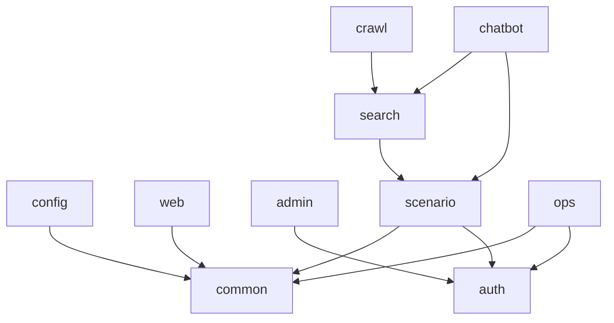

# 모듈 의존성

> 작성일: 2026-05-08

## 1. 패키지 경계

| 패키지 | 허용 역할 |
|---|---|
| `config` | Spring/Security/MyBatis/Web 설정 |
| `common` | 공통 응답, 예외, 감사, 검증, 유틸 |
| `web` | 공개 사이트 공통 화면 |
| `domain.auth` | 인증/권한/로그인 이력 |
| `domain.admin` | 관리자 공통 화면 |
| `domain.scenario` | 시나리오 관리 |
| `domain.chatbot` | 챗봇 런타임 |
| `domain.search` | 검색 |
| `domain.crawl` | 크롤링/파싱 |
| `domain.ops` | 운영/공지/통계/로그 조회 |

## 2. 의존 방향

## 3. 구현 규칙

- Controller는 Service만 호출한다.
- Service는 Mapper와 다른 도메인의 공개 Service/Port만 호출한다.
- Mapper 인터페이스와 XML은 같은 도메인에 둔다.
- DTO는 화면/API 경계를 나타내고, DB row 모델과 무리하게 공유하지 않는다.
- 순환 의존이 생기면 `common`으로 이동하기보다 도메인 이벤트 또는 포트 인터페이스를 먼저 검토한다.

## 4. M2 시나리오 모듈 예상 파일

| 파일/패키지 | 용도 |
|---|---|
| `domain/scenario/controller/ScenarioAdminController.java` | 관리자 화면 라우팅 |
| `domain/scenario/controller/ScenarioApiController.java` | 시나리오 REST API |
| `domain/scenario/service/ScenarioService.java` | 트랜잭션/업무 규칙 |
| `domain/scenario/mapper/ScenarioMapper.java` | MyBatis 매퍼 인터페이스 |
| `resources/mapper/scenario/ScenarioMapper.xml` | SQL |
| `domain/scenario/dto/*` | 요청/응답 DTO |
| `domain/scenario/model/*` | DB 조회 모델 |
| `db/migration/V3__scenario_baseline.sql` | M2 스키마 |
