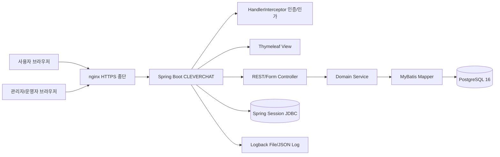
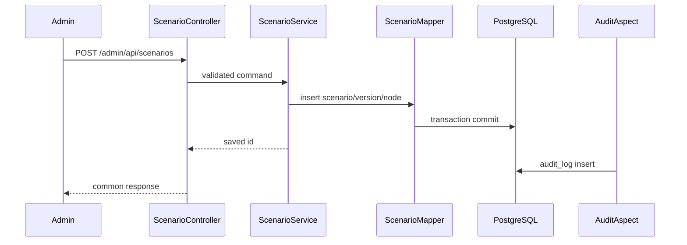

# 시스템 구성도

> 작성일: 2026-05-08
> 범위: M2 구현 기준 기본 아키텍처

## 1. 논리 구성

## 2. 도메인 모듈

| 모듈 | 책임 | 주요 의존 |
|---|---|---|
| `auth` | 관리자 인증, 사용자/권한, 로그인 이력 | HandlerInterceptor + 세션 VO, MyBatis |
| `admin` | 관리자 화면 공통, 대시보드 | auth |
| `scenario` | 시나리오/버전/노드/옵션/키워드 관리 | auth, audit |
| `chatbot` | 사용자 챗봇 진행, 대화 이력 | scenario, search |
| `search` | 키워드/본문/유사어 검색 | scenario, crawl |
| `crawl` | URL 수집, 파싱, 백데이터 적재 | search |
| `ops` | 공지, 통계, 로그 조회, 운영 지표 | auth, audit |
| `common` | 공통 응답, 예외, 감사, 검증 유틸 | 없음 |

## 3. 배포 구성

| 구성요소 | 기본안 | 비고 |
|---|---|---|
| 애플리케이션 | 실행 가능 JAR + systemd | 온프레미스 단일 노드 우선 |
| 웹 서버 | nginx | HTTPS 종단, 정적 리소스 캐시 |
| DB | PostgreSQL 16 | Flyway로 스키마 관리 |
| 세션 | Spring Session JDBC | 다중 노드 전환 시 Redis 재검토 |
| 캐시 | Caffeine | 시나리오 활성 버전, 코드성 데이터 |
| 로그 | Logback 파일 | 운영은 JSON 패턴과 logrotate 적용 |

## 4. 요청 흐름

### 관리자 시나리오 저장

## 5. 설계 원칙

- 관리자 상태 변경은 서버 측 권한 검사와 CSRF 보호를 모두 적용한다.
- 도메인별 SQL은 MyBatis XML에 둔다.
- 트랜잭션 경계는 서비스 계층에 둔다.
- M2부터 상태 변경 서비스에는 `@Audited` 적용을 기본값으로 한다.
- 외부 연동이 필요한 크롤링/AI/검색 엔진은 도메인 인터페이스 뒤에 숨긴다.
