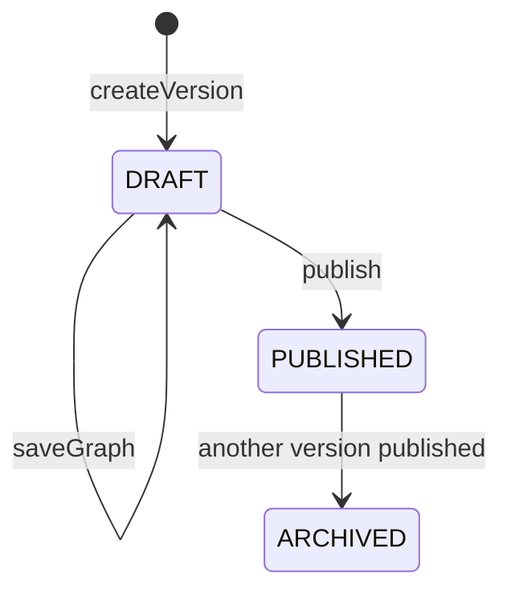
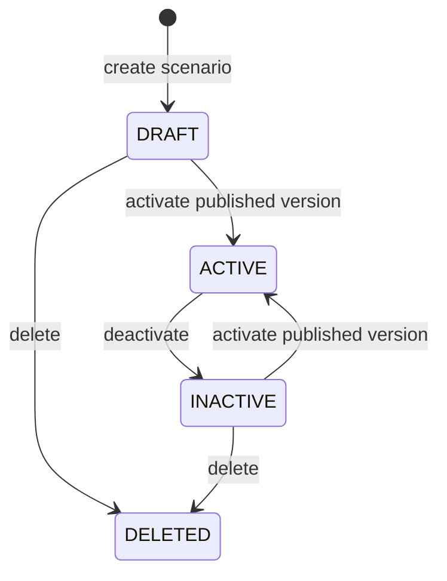

# P0 Scenario Graph Edit View 작업지시서

> 작성일: 2026-05-26  
> 대상 프로젝트: `3.개발/cleverchat`  
> 작업 성격: 구현 위임용 작업지시서  
> 원칙: 본 문서는 작업 정의 문서이며, 실제 코드 수정은 후속 구현 PR에서 수행한다.

## 1. 목적

Scenario workflow P0의 첫 항목으로 DRAFT 버전의 그래프 편집/저장 화면을 신설 또는 기존 상세 화면에 연결한다.

현재 관리자 시나리오 화면은 목록, 등록, 상세, 새 초안 생성, 미리보기, 게시 흐름을 일부 제공한다. 그러나 DRAFT 버전에 노드/옵션 그래프를 편집하고 저장하는 화면 진입점이 명확하지 않다. P0에서는 운영자가 다음 흐름을 끊김 없이 수행할 수 있도록 그래프 편집 화면과 저장 API 연결을 우선 정의한다.

`목록 -> 상세 -> 새초안 -> 편집 -> 그래프저장 -> 미리보기 -> 게시`

## 2. P0 첫 항목 정의

| 우선순위 | 항목 | 목표 | 완료 기준 |
|---|---|---|---|
| P0-01 | DRAFT 그래프 편집/저장 화면 신설 또는 연결 | `scenario_version.status=DRAFT` 버전을 화면에서 편집하고 기존 graph 저장 API로 저장할 수 있게 한다. | 상세 화면의 DRAFT 버전 행에서 편집 진입 가능, 편집 화면 저장 성공, 저장 후 미리보기/게시 가능 |

P0-01은 새 기능의 최소 단위다. 신규 화면을 만들거나 기존 상세 화면에 편집 패널을 삽입할 수 있으나, 사용자 흐름은 반드시 위 순서를 만족해야 한다.

## 3. 현재 기준

### 3.1 화면 흐름

| 단계 | 현재 후보 | 현황 |
|---|---|---|
| 목록 | `GET /admin/scenarios` | `scenarioList.html` 존재 |
| 상세 | `GET /admin/scenarios/{id}` | `scenarioView.html` 존재 |
| 새초안 | `POST /admin/scenarios/{id}/versions` | 상세 화면 버튼 존재 |
| 편집 | 후보 필요 | DRAFT graph 편집 화면 또는 링크 미정 |
| 그래프저장 | `PUT /admin/api/scenarios/versions/{versionId}/graph` | API 컨트롤러/서비스 존재 |
| 미리보기 | `GET /admin/scenarios/versions/{versionId}/preview` | preview layer 존재 |
| 게시 | `POST /admin/scenarios/versions/{versionId}/publish` | 화면/ API 처리 존재 |

### 3.2 데이터 상태

| 대상 | 상태값 |
|---|---|
| `scenario.status` | `DRAFT`, `ACTIVE`, `INACTIVE`, `DELETED` |
| `scenario_version.status` | `DRAFT`, `PUBLISHED`, `ARCHIVED` |
| `scenario_node.node_type` | `QUESTION`, `ANSWER`, `BRANCH`, `END` |

## 4. 대상 파일 후보

### 4.1 Controller 후보

| 후보 | 역할 | 작업 후보 |
|---|---|---|
| `AdmScenarioController.java` | 관리자 화면 컨트롤러 | DRAFT 버전 그래프 편집 화면 `GET` 추가 또는 상세 화면 model 보강 |
| `AdmScenarioApiController.java` | 관리자 scenario REST API | 기존 graph 저장 API 유지, 필요 시 graph 조회 API 후보 검토 |

권장 화면 URL 후보:

| Method | Path | 설명 |
|---|---|---|
| GET | `/admin/scenarios/{scenarioId}/versions/{versionId}/graph` | DRAFT 버전 그래프 편집 화면 |

대안 URL 후보:

| Method | Path | 설명 |
|---|---|---|
| GET | `/admin/scenarios/versions/{versionId}/graph` | 현재 preview URL 형태와 가까움 |

권장안은 `scenarioId`를 포함하는 첫 번째 URL이다. 상세 화면에서 버전이 해당 시나리오에 속하는지 확인하기 쉽고, 화면 breadcrumb/redirect 구성도 명확하다.

### 4.2 Service 후보

| 후보 | 역할 | 작업 후보 |
|---|---|---|
| `ScenarioService` | 시나리오/버전/그래프 업무 로직 | 편집 화면용 graph 조회 메서드 후보 추가, 기존 `saveGraph` 재사용 |
| `ScenarioGraphValidator` | 그래프 저장/게시 검증 | 저장 검증 재사용, 게시 검증과 화면 검증 메시지 정렬 |

graph 조회 후보 메서드:

| 메서드 후보 | 설명 |
|---|---|
| `graph(Long versionId)` | `ScenarioGraphDtos.SaveRequest` 또는 화면 전용 DTO로 현재 저장 그래프 반환 |
| `versionForScenario(Long scenarioId, Long versionId)` | 버전 소속 검증과 상태 확인을 명시적으로 수행 |

`persistedGraph`가 현재 private helper이면 화면 조회용 public 메서드로 무리하게 노출하지 말고, 읽기 전용 DTO를 별도로 구성한다.

### 4.3 Template 후보

| 후보 | 역할 | 작업 후보 |
|---|---|---|
| `scenarioView.html` | 상세/버전 목록 | DRAFT 버전 행에 `편집` 버튼 추가 |
| `scenarioGraphEdit.html` | 신규 후보 | 노드/옵션 편집 및 저장 화면 |
| `scenarioPreviewLayer.html` | 미리보기 | 저장 후 미리보기 연결 유지 |
| `admmgr/common/_csrfHidden.html` | CSRF hidden | form 방식 사용 시 재사용 |
| `admmgr/common/head.html` | 공통 head | AJAX CSRF meta/header 사용 여부 확인 |

신규 템플릿 권장명:

`3.개발/cleverchat/src/main/resources/templates/admmgr/scenario/scenarioGraphEdit.html`

화면 컨트롤러 반환명:

`admmgr/scenario/scenarioGraphEdit`

### 4.4 API 후보

| Method | Path | 현황/후보 | 설명 |
|---|---|---|---|
| GET | `/admin/api/scenarios/{id}` | 기존 | 시나리오 기본정보 조회 |
| POST | `/admin/api/scenarios/{id}/versions` | 기존 | 새 DRAFT 버전 생성 |
| PUT | `/admin/api/scenarios/versions/{versionId}/graph` | 기존 | DRAFT 그래프 저장 |
| GET | `/admin/api/scenarios/versions/{versionId}/graph` | 후보 | 편집 화면 초기 graph JSON 조회 |
| GET | `/admin/scenarios/versions/{versionId}/preview` | 기존 화면 | 미리보기 layer |
| POST | `/admin/scenarios/versions/{versionId}/publish` | 기존 화면 | 게시 처리 |

GET graph API는 화면에서 JSON 기반 editor를 구성할 때만 추가한다. 서버 렌더링 model로 충분하면 신규 API를 만들지 않는다.

## 5. 사용자 흐름

1. 운영자가 `/admin/scenarios` 목록에 진입한다.
2. 목록에서 시나리오 제목을 클릭해 `/admin/scenarios/{scenarioId}` 상세 화면으로 이동한다.
3. 상세 화면의 버전 영역에서 `새 초안`을 클릭한다.
4. 생성된 `DRAFT` 버전 행에 `편집` 버튼이 표시된다.
5. `편집` 클릭 시 그래프 편집 화면으로 이동한다.
6. 운영자가 시작 노드, 노드 목록, 옵션 목록을 편집한다.
7. `저장` 클릭 시 `PUT /admin/api/scenarios/versions/{versionId}/graph`로 저장한다.
8. 저장 성공 후 같은 편집 화면에 머물거나 상세 화면으로 돌아간다. 어느 쪽이든 미리보기 진입이 가능해야 한다.
9. `미리보기`에서 시작 노드 기준 흐름을 확인한다.
10. 문제가 없으면 `게시`를 실행한다.

## 6. 상태 전이

### 6.1 버전 상태



### 6.2 시나리오 상태



### 6.3 P0 작업에서 지켜야 할 상태 규칙

| 행위 | 허용 상태 | 금지 상태 | 기대 오류 |
|---|---|---|---|
| 그래프 편집 화면 진입 | `scenario_version.status=DRAFT` | `PUBLISHED`, `ARCHIVED` | 409 또는 읽기 전용 처리 |
| 그래프 저장 | `scenario_version.status=DRAFT` | `PUBLISHED`, `ARCHIVED` | `STATE_CONFLICT` |
| 미리보기 | `DRAFT`, `PUBLISHED`, `ARCHIVED` | 삭제된 시나리오의 버전 | 404 또는 정책 오류 |
| 게시 | 저장된 graph가 있는 `DRAFT` | 시작 노드 없음, 노드 없음, invalid edge | validation error |
| 활성화 | `PUBLISHED` 버전 | `DRAFT`, `ARCHIVED` | `STATE_CONFLICT` |

## 7. 화면 요구사항

### 7.1 상세 화면 변경 후보

`scenarioView.html`의 버전 목록 작업 열에 DRAFT 버전 전용 `편집` 버튼을 추가한다.

권장 노출 조건:

| 버튼 | 조건 |
|---|---|
| 편집 | `version.status == 'DRAFT'` |
| 미리보기 | 모든 버전, 단 graph가 없을 때 빈 상태 메시지 허용 |
| 게시 | `version.status == 'DRAFT'` |
| 활성화 | `version.status == 'PUBLISHED' and scenario.status != 'ACTIVE'` |

### 7.2 그래프 편집 화면 최소 구성

| 영역 | 필수 여부 | 설명 |
|---|---|---|
| 시나리오/버전 헤더 | 필수 | 제목, 버전 번호, 버전 상태 |
| 시작 노드 선택 | 필수 | `startNodeKey` 지정 |
| 노드 목록 | 필수 | nodeKey, nodeType, title, content, sortOrder, metadata |
| 옵션 목록 | 필수 | label, nextNodeKey, conditionExpr, sortOrder, enabled |
| 저장 버튼 | 필수 | graph 저장 API 호출 |
| 미리보기 버튼 | 필수 | preview layer 또는 preview 화면 이동 |
| 상세 돌아가기 | 필수 | `/admin/scenarios/{scenarioId}` |

P0에서는 고급 canvas editor가 필수는 아니다. 표/폼 기반 편집이라도 graph DTO를 정확히 저장하고 미리보기/게시로 이어지면 완료로 본다.

### 7.3 입력 UX 기준

| 필드 | 기준 |
|---|---|
| `nodeKey` | 화면에서 중복 방지 또는 저장 전 오류 표시 |
| `nodeType` | `QUESTION`, `ANSWER`, `BRANCH`, `END` 선택형 |
| `nextNodeKey` | 같은 버전의 nodeKey 중 선택, END 노드 옵션 금지 |
| `enabled` | 옵션 활성 여부 토글/체크박스 |
| `metadata` | P0에서는 raw JSON textarea 허용, invalid JSON은 저장 전 차단 후보 |

## 8. 저장 계약

기존 저장 DTO를 기준으로 한다.

```json
{
  "startNodeKey": "start",
  "nodes": [
    {
      "nodeKey": "start",
      "nodeType": "QUESTION",
      "title": "문의 유형 선택",
      "content": "무엇을 도와드릴까요?",
      "sortOrder": 1,
      "metadata": "{}",
      "options": [
        {
          "label": "가입 방법",
          "nextNodeKey": "join-guide",
          "conditionExpr": null,
          "sortOrder": 1,
          "enabled": true
        }
      ]
    }
  ]
}
```

저장 성공 응답은 기존 `ApiResponse.ok()` envelope를 유지한다. 저장 실패 시 전역 오류 응답 형식을 변경하지 않는다.

## 9. 금지 범위

P0-01에서 아래 작업은 금지한다.

| 금지 항목 | 사유 |
|---|---|
| DB/Flyway 변경 | 기존 graph 테이블과 DTO로 처리 가능 |
| mapper XML namespace/SQL ID 대규모 변경 | graph 편집 화면 연결과 무관 |
| `ApiResponse` envelope 변경 | 기존 API 계약 유지 |
| scenario 상태값 추가 | 현재 상태 전이로 충분 |
| 인증/권한 체계 변경 | 기존 `/admin/**`, `/admin/api/**` 정책 사용 |
| URL 트리 전면 개편 | 기존 `/admin/scenarios` 계열 유지 |
| 게시/활성화 업무 규칙 변경 | 기존 `ScenarioService.publish/activate` 기준 유지 |
| canvas/drag-drop 고급 편집기 필수화 | P0에서는 저장 가능한 폼 기반 화면 허용 |
| 타 도메인 수정 | auth, chatbot, search, crawl 변경 금지 |
| 외부 CDN/외부 전송 추가 | 운영망/보안 검토 전 금지 |

## 10. 검증 시나리오

### 10.1 자동 검증 후보

| ID | 시나리오 | 기대 결과 |
|---|---|---|
| P0-GE-TC-001 | DRAFT 버전 편집 화면 GET | 200, `scenarioGraphEdit` 렌더링 |
| P0-GE-TC-002 | PUBLISHED 버전 편집 화면 GET | 409 또는 읽기 전용 정책에 맞는 응답 |
| P0-GE-TC-003 | DRAFT graph 저장 PUT | `ApiResponse.ok`, node/option 저장 |
| P0-GE-TC-004 | 시작 노드 없는 graph 저장 | validation error |
| P0-GE-TC-005 | 없는 `nextNodeKey` 저장 | validation error |
| P0-GE-TC-006 | END 노드에 option 포함 | validation error |
| P0-GE-TC-007 | graph 저장 후 미리보기 GET | 시작 노드와 옵션 표시 |
| P0-GE-TC-008 | graph 저장 후 게시 POST | DRAFT -> PUBLISHED |
| P0-GE-TC-009 | 게시 후 같은 version graph 저장 | `STATE_CONFLICT` |
| P0-GE-TC-010 | 권한 없는 사용자 편집 화면 접근 | 로그인 요구 또는 403 |

### 10.2 수동 검증 경로

```bash
cd /mnt/c/02.Project/02.자바/01.WorkSpace/CLEVERCHAT/3.개발/cleverchat
./mvnw clean test
./mvnw spring-boot:run
```

수동 확인:

1. `/admin/scenarios` 목록 진입
2. 기존 또는 신규 시나리오 상세 진입
3. `새 초안` 생성
4. DRAFT 버전 행의 `편집` 진입
5. QUESTION 시작 노드 1개, ANSWER 또는 END 노드 1개, 옵션 1개 저장
6. 미리보기에서 시작 노드와 옵션 이동 확인
7. 게시 성공 확인
8. 게시된 버전 편집/저장 차단 확인

## 11. 설계 문서 보완 후보

후속 구현 PR에서 코드와 함께 아래 문서 보완을 검토한다.

| 문서 | 보완 후보 |
|---|---|
| `2.설계/01.화면설계서/화면목록.md` | `scenarioGraphEdit` 화면 추가 |
| `2.설계/03.API설계서/M2_시나리오API.md` | graph 편집 화면 URL 및 GET graph API 채택 시 API 추가 |
| `2.설계/02.DB설계서/M2_시나리오ERD.md` | DB 변경 없음 명시, 기존 node/option 재사용 |
| `2.설계/05.보안설계서/보안체크리스트.md` | AJAX CSRF, 관리자 권한, 외부 전송 없음 확인 |
| `2.설계/01.화면설계서/접근성체크리스트.md` | 키보드 조작, label, 오류 메시지 연결 확인 |
| `2.설계/06.운영메모/M2_운영메모.md` | 게시 전 graph 저장/미리보기 운영 절차 추가 |
| `4.테스트/02.테스트시나리오/M2_시나리오테스트.md` | P0-GE 테스트 케이스 추가 |

## 12. 구현 작업 분해

| 순서 | 작업 | 산출물 |
|---|---|---|
| 1 | 상세 화면 DRAFT 버전 행에 편집 링크 추가 | `scenarioView.html` |
| 2 | graph 편집 화면 GET route 추가 | `AdmScenarioController.java` |
| 3 | graph 조회용 service/model 구성 | `ScenarioService.java`, DTO 후보 |
| 4 | graph 편집 템플릿 추가 | `scenarioGraphEdit.html` |
| 5 | 저장 호출 연결 | 기존 `PUT /admin/api/scenarios/versions/{versionId}/graph` |
| 6 | CSRF/error handling 연결 | 공통 CSRF/오류 표시 |
| 7 | 미리보기/게시 버튼 연결 | 기존 preview/publish URL |
| 8 | 테스트 추가 | controller/service 또는 통합 테스트 |
| 9 | 설계/테스트 문서 동기화 | §11 문서 후보 |

## 13. 완료 기준

1. 목록에서 상세로 이동할 수 있다.
2. 상세에서 새 DRAFT 버전을 만들 수 있다.
3. DRAFT 버전 행에서 그래프 편집 화면으로 이동할 수 있다.
4. 그래프 편집 화면에서 시작 노드, 노드, 옵션을 저장할 수 있다.
5. 저장은 기존 graph 저장 API와 `ApiResponse` envelope를 사용한다.
6. 저장된 그래프를 미리보기에서 확인할 수 있다.
7. DRAFT 버전을 게시할 수 있다.
8. PUBLISHED/ARCHIVED 버전은 편집 저장할 수 없다.
9. DB/Flyway/API envelope/권한 체계가 변경되지 않는다.
10. `./mvnw clean test`가 통과한다.

## 부록 A. 커밋 후보

구현 PR 커밋 후보:

```text
feat(scenario): add draft graph edit screen workflow
```

문서 동기화가 별도 커밋이면:

```text
docs(scenario): define graph edit view P0 workflow
```

테스트 보강이 별도 커밋이면:

```text
test(scenario): cover draft graph edit save workflow
```

## 부록 B. 리뷰 체크리스트

| 항목 | 확인 |
|---|---|
| 상세 화면에서 DRAFT 버전에만 편집 버튼이 보이는가 |  |
| 편집 화면 URL이 기존 `/admin/scenarios` 트리와 일관되는가 |  |
| graph 저장이 `DRAFT` 버전에만 허용되는가 |  |
| 저장 전/후 nodeKey, startNodeKey, nextNodeKey 정합성이 유지되는가 |  |
| END 노드 옵션 금지가 유지되는가 |  |
| 미리보기/게시 흐름이 기존 URL과 연결되는가 |  |
| AJAX 사용 시 CSRF header가 포함되는가 |  |
| 오류 메시지가 사용자에게 표시되는가 |  |
| API envelope와 공통 오류 형식이 유지되는가 |  |
| DB/Flyway/타 도메인 변경이 없는가 |  |
