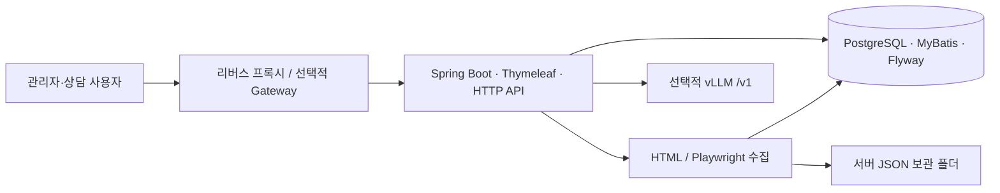

# CLEVERCHAT 인수인계서

작성일: 2026-09-28 · 작성: Codex · 개정 사유: 전체 DB 명세와 실행·운영·연계 인계 자료 보완

## 기준과 읽는 순서

2026-09-29 추가: 최초 다운로드 후 Windows 실행은 [README.md](../../README.md)를 사용한다. 자동 스크립트가 DB 연결/마이그레이션 상태를 점검하고 첫 계정 준비·빌드·서버 기동을 처리한다.

기본 메뉴·공통코드·역할·권한 연결은 [기본 백데이터 묶음](../../3.개발/cleverchat/deploy/seed/README.md)에 별도로 정리했다. 최초 계정은 설치 입력으로 생성하며, 이 묶음에는 실제 사용자나 비밀번호를 포함하지 않는다.

현재 작업 폴더의 소스와 실행 중인 **개발 PostgreSQL**을 대조한 문서다. 미커밋 변경과 신규 파일을 포함한다. 운영 서버에 배포되었거나 외부 시스템과 검수까지 완료되었다는 뜻은 아니다. 인계 시점의 소스 커밋·JAR 해시·DB 백업을 확정해 함께 전달한다.

| 순서 | 문서 | 확인할 내용 |
|---:|---|---|
| 1 | 이 문서 | 구현 범위, 구조, 자료 위치 |
| 2 | [환경 구축·배포 가이드](../02.환경구축가이드/환경구축_배포가이드.md) | 신규 실행, 최초 계정, 배포·롤백 |
| 3 | [시스템 설정·환경변수](../02.환경구축가이드/시스템설정_환경변수.md) | DB 설정 우선순위, 서버 설정, 비밀정보 |
| 4 | [테이블 명세서](../../2.설계/02.DB설계서/테이블명세서.md) | 42개 테이블, 427개 컬럼, 키·제약조건·인덱스 |
| 5 | [DB 관계·데이터 인계](../../2.설계/02.DB설계서/DB관계_데이터인계.md) | 핵심 관계, JSON 논리 참조, 데이터 이관 |
| 6 | [운영·장애 대응](../03.운영매뉴얼/운영_장애대응.md) | 크롤링/JSON/검색/로그/정리/복구 |
| 7 | [외부 연계 인계](외부연계_인수인계.md) | Gateway SSO, vLLM, 미확정 계약 |
| 8 | [인수 검수·미결 사항](인수검수_미결사항.md) | 실제 인수자가 수행할 검수와 결정사항 |

## 현재 구현 범위

| 기능 | 구현 상태와 인계 유의점 |
|---|---|
| 관리자·CMS | 로컬 로그인, 계정/역할, 메뉴/공통코드, IP 허용목록, 감사 로그. CMS 메뉴 권한과 서버의 ADMIN/OPERATOR 역할 검사를 함께 확인 |
| 시스템 설정 | `/admin/system-settings`, ADMIN 전용. 독립/연계, 파일·보관, 크롤링, 검색·챗봇, AI 연결 |
| 시나리오 | 카테고리·키워드·동의어·버전·노드·선택지·원문 링크, 발행 및 정렬 |
| 사용자 챗봇 | `/chat`, 시나리오 선택·자유질문·문서 보기·피드백·이전 대화. 실제 방문 이력 기준의 공통 `이전` 버튼 |
| 검색 | PostgreSQL 검색 SQL과 Nori 토큰 사용. 발행된 활성 시나리오/노드와 수집 문서에서 관련 결과를 선별 |
| 크롤링 | 일반 HTML 및 Playwright 브라우저 수집, 작업 큐/예약/재시도/커버리지/실행 이력, 대상별 JSON 저장 |
| 운영 | 통계·공지·알림·로그·암호화·보관 데이터 정리. 백업은 외부 스크립트이며 앱에서 예약 백업하지 않음 |
| Gateway SSO | 헤더 검증/JIT 계정/역할/모드 전환 구현. 실제 Gateway 종단 검수는 별도 |
| vLLM | 모델 조회와 Chat Completions 호출 구현. 실제 서버 주소·모델·인증/성능 검수는 별도 |
| 외부 REST/온톨로지 | REST는 인증 및 `/external/api/v1/status` 기반 코드까지. 온톨로지 조회·개념 매핑·동기화 계약/구현은 별도 범위 |

## 기술 구조와 수정 위치

| 위치(앱 루트 기준) | 역할 |
|---|---|
| `src/main/java/kr/co/cleverchat/domain` | auth, adminmanage, settings, scenario, chatbot, search, crawl, ops, externalapi |
| `src/main/java/kr/co/cleverchat/common`, `config` | 예외·응답·감사·암호화·검색 토큰·인터셉터 설정 |
| `src/main/resources/mapper` | MyBatis SQL. JPA를 사용하지 않음 |
| `src/main/resources/db/migration` | SQL 47개, V1~V44 및 중간 버전. 적용된 SQL 파일을 수정하지 않고 신규 버전 추가 |
| `src/main/resources/templates`, `static/asset` | Thymeleaf 화면, 관리자/상담 JavaScript와 CSS |
| `src/main/resources/application*.yml`, `logback-spring.xml` | 프로파일별 실행·로그 기본 설정 |
| `src/test`, `pom.xml` | 단위/통합 테스트, 의존성 및 빌드 |
| `deploy/backup`, `deploy/embed` | 백업 샘플, 상담 임베드 샘플 |
| `tools/export_db_spec.py` | 읽기 전용 DB 명세 재생성 도구 |

앱 루트는 [3.개발/cleverchat](../../3.개발/cleverchat)이다. Java 17, Spring Boot 3.3.5, MyBatis 3.0.3, PostgreSQL 16 계열, Playwright Java 1.49.0, Jsoup 1.18.1, Lucene Nori 9.11.1이 기준이다. 정확한 의존성은 [pom.xml](../../3.개발/cleverchat/pom.xml)을 확인한다. 인증은 세션·필터·인터셉터·역할 AOP로 구현되어 있으며 Spring Security 필터 체인을 사용하지 않는다.

## 이전 작업 자료와 현재 기준

| 자료 | 용도 |
|---|---|
| [M3 챗봇 런타임 API](../../2.설계/03.API설계서/M3_챗봇런타임API.md), [M4 검색 API](../../2.설계/03.API설계서/M4_검색API.md) | 현재 선택·검색·이전 API 필드와 동작 |
| [KEPCO 시나리오 구성서](../../2.설계/01.화면설계서/KEPCO_크롤링기반_시나리오구성서_2026-09-22.md) | 시나리오 문구, 근거 링크, 메뉴 구성 |
| [JSON 저장 작업 결과](../../3.개발/cleverchat/docs/REVIEW-crawl-json-export-2026-09-21.md) | 크롤링 파일 저장 규격과 당시 검증 |
| [시스템 설정 결과](../../3.개발/cleverchat/docs/RESULT-system-settings-2026-09-22.md), [런타임 설정 결과](../../3.개발/cleverchat/docs/RESULT-runtime-settings-integration-2026-09-22.md) | V43/V44 구현 및 당시 검증 범위 |
| [기획 연계 가이드](../../1.기획/INTEGRATION_GUIDE_v1.0.md) | 외부 플랫폼 요구사항. 이 문서에 적힌 모든 API가 구현된 상태는 아님 |
| [백업 정책](../05.백업복구절차서/백업정책.md), [복구 리허설](../05.백업복구절차서/복구리허설_체크리스트.md) | 기존 정책과 운영 검수 양식 |

초기 ERD·WORKORDER·루트 PENDING/RESULT는 작성 당시 기록이다. 현재 동작은 최신 코드와 이 인계 묶음을 우선한다. 특히 AI가 전부 스텁이라는 초기 설명, V20 이전 테이블명, 검색 최소점수 미달 시 1건 강제 노출이라는 옛 설명은 현재 구현과 다르다.

## 반드시 함께 넘길 자산

- 확정 소스 전체와 JAR, Git 커밋/버전, JAR SHA-256, 빌드·테스트 보고서. `target` 임시 산출물만으로 소스 인계를 대신하지 않는다.
- DB 백업과 검증 해시. **KEPCO 운영 콘텐츠와 수집 데이터는 코드만 복제해 복원되지 않는다.** Flyway의 구조/기초 코드와 실제 업무 데이터를 구분한다.
- JSON 원본 파일, 원래 저장 루트와 새 서버 경로 대응표, 네이티브 번들이 사용 중이면 해당 검증 자산.
- 암호화 현재 키·이전 키, DB 인증, Gateway 시크릿, vLLM 키, TLS 자료는 승인된 비밀 저장소로 별도 전달한다. 문서에는 보관 위치·담당자만 기록한다.
- 운영 도메인/서버/DB/방화벽/서비스 계정, 백업 저장소/예약 설정, 장애 연락망과 미결 항목. 확인되지 않은 값은 검수표에 남긴다.

## 이번 문서 작업의 검증 범위

2026-09-28 개발 DB를 읽기 전용으로 조회해 테이블 42개·컬럼 427개·FK 52개·인덱스 138개·시퀀스 33개를 확인했다. SQL 47개가 모두 적용 성공이며 소스 파일명과 대조했다. Flyway 자체 체크섬 검증, 애플리케이션 전체 테스트, 실제 운영 배포·외부 SSO·실제 vLLM·백업 복구 리허설을 이번 문서 작업에서 새로 수행한 것은 아니다.

신규 Markdown 8개의 로컬 문서·소스 링크 132개, 전체 컬럼/제약/인덱스의 명세 포함 여부를 검사했다. 추출 도구를 같은 기준일로 다시 실행해 Markdown/JSON이 동일하게 생성되는 것도 확인했다. DB COMMENT가 없는 컬럼 108개는 소스 기반 설명으로 구분하여 보완했다.
